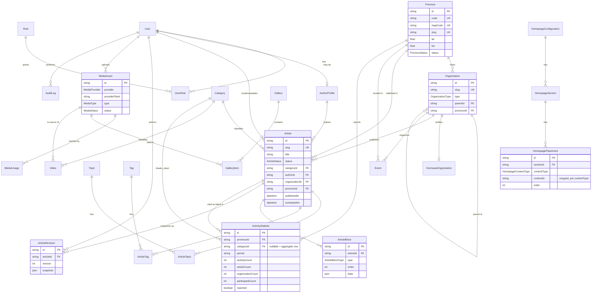
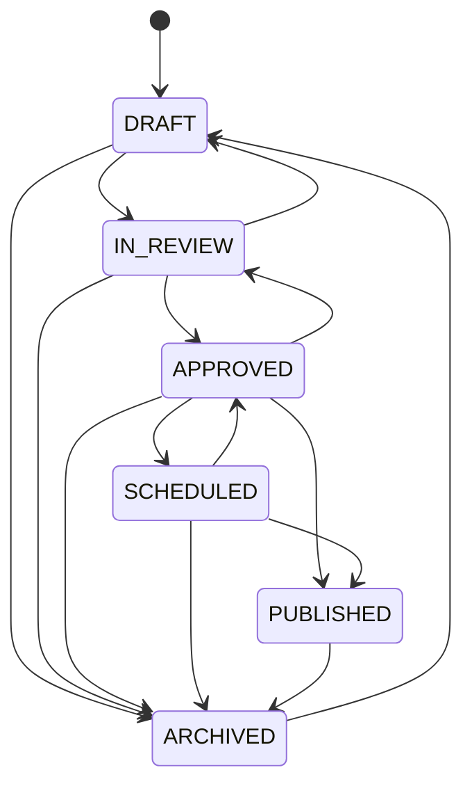

# Database schema

The production schema backing `prisma/schema.prisma` — every table, the
non-obvious modeling decisions behind it, and the scope this task
deliberately left out. See `docs/BACKEND_ARCHITECTURE.md` for how the
service/repository layer above this schema is organized, and
`docs/ENVIRONMENT.md` for how to actually get a database running against
it.

## ERD

## Table-by-table notes

### Identity & access

| Table | Purpose |
|---|---|
| `User` | A system account that can log in. |
| `Role` / `UserRole` | Named permission bundles, many-to-many with `User`. |
| `AuthorProfile` | The public byline a reader sees — see "AuthorProfile vs. User" below. |

**AuthorProfile vs. User.** These are deliberately two different tables,
not one with an "is a byline" flag. A byline ("Ban Biên tập", a named
contributor) is not always a person with a CMS login, and a person with a
login is not always the credited writer of a piece (an editor publishing
someone else's submitted copy). `AuthorProfile.userId` is nullable for
exactly this reason. `Article.authorId` points at `AuthorProfile` (who
gets credit); `Article.createdById`/`updatedById` point at `User` (which
system account actually performed the write) — two different questions
that a single "author" column would conflate.

**No permission-matrix table yet.** `Role` is just a name + description
today, not a `Permission`/`RolePermission` structure. There's no CMS UI in
this task to enforce fine-grained permissions against (brief item 18), so
building the matrix now would be speculative. Adding `Permission` +
`RolePermission` tables later, once real admin routes exist to check them
against, doesn't require touching anything built here.

### Taxonomy — three tables, on purpose

Brief section 6 explicitly warns against folding `Category`/`Topic`/`Tag`
into one table "nếu chức năng thực tế khác nhau" — and their actual
behavior *is* different:

| Table | Cardinality per article | Has a landing page | Notes |
|---|---|---|---|
| `Category` | Exactly one (`Article.categoryId`, required) | Yes (`/chuyen-muc/[slug]`) | Primary classification. Also doubles as the Activity Map's category-breakdown dimension (`ActivityStatistic.categoryId`) — see below. |
| `Topic` | Zero or more (`ArticleTopic` join table) | Yes (`/chu-de/[slug]`) | A curated editorial theme spanning several articles. |
| `Tag` | Zero or more (`ArticleTag` join table) | No | Freeform keyword. |

**Category doubles as the Activity Map's category filter.** The map's
fixture (`public/data/activity-map.json`) filter chips — "Tình nguyện",
"Nghiên cứu khoa học", "Sinh viên 5 tốt", "Hội nhập" — are the same
Vietnamese concepts as the article categories in
`src/data-access/fixtures/taxonomy.ts`, just with a different slug
convention in that one JSON file (`sv5tot` vs `sinh-vien-5-tot`, etc — see
"Known fixture inconsistency" below). One `Category` table serving both
roles is a deliberate simplification, not an accidental collision.

### ARTICLE STATUS

Six explicit states, not a `published: boolean` — brief section 3 requires
this outright, and it's a real distinction: `SCHEDULED` (will go live at
`scheduledAt`) and `PUBLISHED` (is live now) are different facts that a
single boolean can't hold apart. The legal-transition table itself lives
in exactly one place, `src/server/services/articleService.ts`'s
`ALLOWED_TRANSITIONS`, not duplicated at the schema level (Postgres enums
don't express transition rules, only the set of valid values).

### ACTIVITY-STAT SHAPE

Brief section 8's literal minimum field list for `ActivityStatistic` is
`provinceId, categoryId optional, period, activityCount, articleCount,
organizationCount, participantCount, updatedAt` — and that "optional" on
`categoryId` is the key to the whole design. One row per
**(province, category, period)**:

- A row with `categoryId = null` is that province's **aggregate** for the
  period — the same numbers the fixture stores at the top level of a
  province entry (`activity_count`, `article_count`, `unit_count`,
  `student_count`).
- A row *with* `categoryId` set is one entry of that same fixture's
  `category_distribution` map (e.g. `{ "sv5tot": 118, "tinhnguyen": 142 }`).

One table serves both shapes the frontend already reads
(`ActivityMapProvince`'s top-level fields and its `category_distribution`)
instead of a separate breakdown table — see
`src/server/services/activityMapService.ts` for the code that reassembles
both back into that exact frontend shape.

**Known caveat:** `@@unique([provinceId, categoryId, period])` cannot by
itself stop two aggregate rows (`categoryId: null`) for the same
province+period, because Postgres treats every `NULL` in a unique index as
distinct from every other `NULL` — the constraint only actually protects
rows with a real category. `src/server/repositories/activityMapRepository.ts`'s
`upsertStatistic` works around this with an explicit `findFirst`-then-write
for the aggregate case; this doc calls it out so it isn't "discovered" as a
surprise later.

**`latestArticleId` replaces a denormalized snapshot.** The fixture stores
each province's latest article as a hand-copied `{ title, published_at }`
pair. The schema stores a real foreign key to `Article` instead — a join
can never drift from the article it names, which a copied title/date pair
silently can (edit the article's title, and the fixture's copy is now
wrong).

**Known fixture inconsistency, reconciled during seeding, not fixed at
the source.** `activity-map.json`'s own `categories` field uses different
slugs (`sv5tot`, `tinhnguyen`, `nckh`, `hoinhap`) than
`taxonomy.ts`'s `CATEGORIES` (`sinh-vien-5-tot`, `tinh-nguyen`,
`nghien-cuu`, `hoi-nhap`) for the same four concepts. `prisma/seed.ts`
bridges this with an explicit mapping table rather than either silently
dropping every category-breakdown row (what happens if you don't reconcile
it) or rewriting either frontend fixture (out of scope for a backend
foundation task).

### OVERSEAS ACTIVITY — SCOPE

`Province` gets the full `ActivityStatistic` treatment (per-period,
per-category history) because the brief's own field list asks for exactly
that. `OverseasOrganization` — the Activity Map's globe panel — does not
get a mirrored statistics table. Its `activityCount` is a single
denormalized running total, because that's the *only* shape the current
UI/fixture ever needs (`ActivityMapOverseasCountry: { name, activity_count
}` — no category breakdown, no period history). Building a parallel
`OverseasActivityStatistic` table for a granularity nothing reads yet would
be exactly the kind of speculative schema the brief's "tối thiểu" framing
argues against. If overseas history/breakdown becomes a real requirement,
the natural extension is a table shaped just like `ActivityStatistic` with
`overseasOrganizationId` in place of `provinceId`.

### PROVINCE STATUS

`ProvinceStatus` (`ACTIVE` / `MERGED` / `INACTIVE`) exists because Vietnam's
administrative map is not static — provincial mergers are a real,
recurring event, and every `Article`/`Event`/`ActivityStatistic` row
already pointing at a province that later gets absorbed into another must
keep resolving to *something* rather than a dangling foreign key or a
silently deleted row. A merge is modeled as: the absorbed province's row
gets `status: MERGED` (never deleted), and new content going forward uses
the surviving province's row. No migration logic for *performing* a merge
is built in this task — the enum value exists so the day it's needed, it's
a data change, not a schema change.

### Media & usage tracking

`MediaAsset` is metadata-only, per brief section 10 — no binary storage in
this database or on the app server. Everything else with a `*MediaId`
field (`Article.coverMediaId`, `Organization.logoMediaId`, ...) points at
it directly. `MediaUsage` exists *in addition to* those typed foreign keys
to answer a different question: "what breaks if this specific asset is
deleted or replaced," including references a typed FK can't reach — an
image referenced from inside an `ArticleBlock.data` JSON gallery block, for
instance. `referenceId` there is intentionally untyped (see
"Untyped references" below).

### Untyped references — the same pattern, used three times

Three tables hold a `(discriminator, id)` pair instead of a typed foreign
key, because each one has to be able to point into *several different*
tables depending on the discriminator, and Postgres/Prisma have no native
polymorphic-FK construct:

| Table | Discriminator | Points at |
|---|---|---|
| `MediaUsage` | `usageType` (`MediaUsageType`) | Article, Gallery item, Event, Organization, ... depending on the enum value |
| `HomepagePlacement` | `contentType` (`HomepageContentType`) | Article, Video, Event, Platform, or Gallery |
| `AuditLog` | `entityType` (a plain string) | Literally any table |

Each of these is documented individually in `schema.prisma` at the point
of use; this table exists so the *pattern* is visible in one place instead
of looking like three unrelated decisions.

### Homepage configuration & fallback

`HomepageConfiguration` → `HomepageSection` (one per section key: Hero,
Featured Articles, Story Rail, Video Feature, Platform Cards, Events,
Gallery, Local News) → `HomepagePlacement` (the actual curated content in
each section). Brief section 11's explicit requirement — "phải giữ
fallback tự động nếu CMS chưa cấu hình" — means a section with zero
enabled/currently-active placements is not an error state the schema has
to represent as one; `HomepageService.resolveHomepage()`
(`src/server/services/homepageService.ts`) falls back to an automatic
"most recent N" query for that section instead. The seed script
deliberately seeds all eight `HomepageSection` rows with **no**
placements, so a fresh database exercises the fallback path for every
section from day one, not just the configured-content path.

### Audit log

One row per `CREATE`/`UPDATE`/`DELETE`/`PUBLISH`/`UNPUBLISH`/`APPROVE`/
`LOGIN`. Brief section 12 explicitly says not to log every `GET` — nothing
here does. Every write-path service method in `src/server/services/`
that changes state calls `auditLogRepository.record(...)`.

## Scope exclusions (documented, not silently dropped)

Things `public/data/activity-map.json` carries that this schema does
*not* model as database tables, and why:

- **`archipelagos`** (Hoàng Sa/Trường Sa illustrative markers) — static
  sovereignty-illustration content, not evolving CMS data. Stays as
  frontend-side static config.
- **`note`, `source`, `planned_endpoint`, `geometry_source`** — dataset-level
  methodology notes for one specific reporting cycle, not a distinct
  entity the brief's model list (section 2) asks for.
- **`summary`** (`total_activities`, `total_articles`, ...) — a pure
  aggregate, always computable by summing `ActivityStatistic` rows for the
  latest period (`ActivityMapService.getActiveMapData()` already does
  exactly this). Storing it would just be a cache that could drift from
  its own source rows.

None of this blocks anything the brief actually asks for; each is a
"doesn't need its own table" judgment call, not a missing feature.
